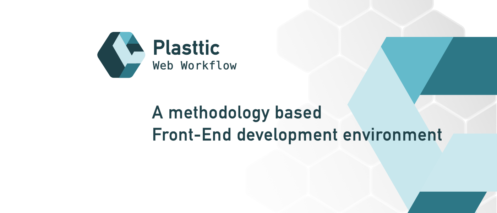

[](https://plasttic.dev)

# Create Plasttic Web Workflow

Quick start for [Plasttic Web Workflow](https://github.com/tojeiro-me/Plasttic)

---

## Start

```
(cd into your projects folder)
npx create-plasttic
cd project-name
npm install
```

1. Creates a folder with the `project name` you defined
2. Downloads and installs the latest version of Plasttic Web Workflow
3. Installs all the project dependencies

### Next

Go to [Plasttic Web Workflow](https://github.com/tojeiro-me/Plasttic#readme) for more information about the files installed.

---

## Follow

---

[](https://twitter.com/Plasttic_Dev)&emsp;[](https://mastodon.social/@plasttic)&emsp;[](https://github.com/tojeiro-me)

---

## License

[MIT](./LICENSE)

---

[](https://github.com/tojeiro-me/Plasttic)
